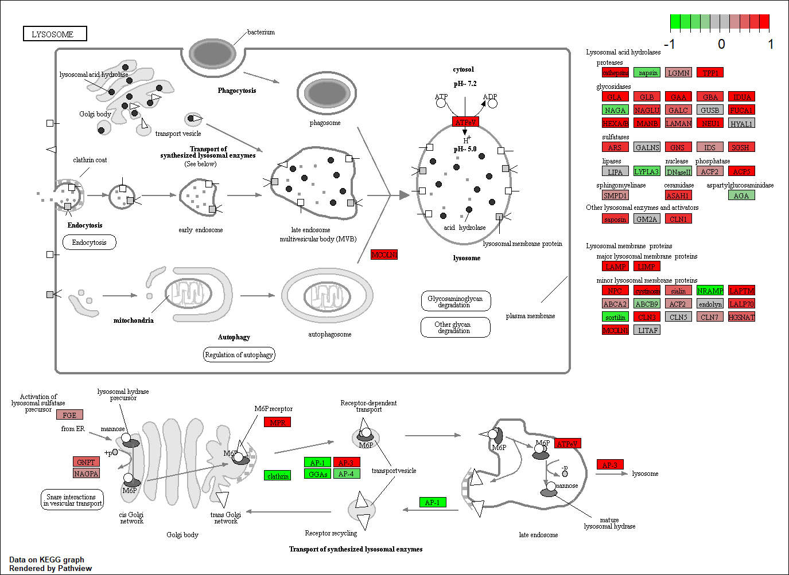

```{r setup, include=FALSE}
knitr::opts_chunk$set(echo = TRUE)
```

## Pathway Analysis from RNA-Seq Results

# Section 1: Differential Expression Analysis

```{r}
library(DESeq2)
```

The data we will be analyzing is from a study of differential analysis of lung fibroblasts in response to loss of the developmental transcription factor HOXA1. 
  Trapnell C, Hendrickson DG, Sauvageau M, Goff L et al. "Differential analysis of gene regulation at transcript resolution with RNA-seq". Nat Biotechnol 2013 Jan;31(1):46-53. PMID: 23222703

```{r}
colData <- read.csv("GSE37704_metadata.csv", row.names = 1)
countData <- read.csv("GSE37704_featurecounts.csv", row.names = 1)
head(colData)
head(countData)
```

Our rows in the colData must match the columns in the countData. Here, we have a column in countData that is called 'length' but needs to be removed.
```{r}
countData_new <- countData[,-1]
head(countData_new)
```

There are also lots of zero entries in there so let's get rid of them as we have no data for these.

```{r}
countData_newnew <- countData_new[which(rowSums(countData_new) != 0), ]
head(countData_newnew)
```

Now we can do the Differential Analysis using DESeq2

```{r}
dds = DESeqDataSetFromMatrix(countData=countData_newnew,
                             colData=colData,
                             design=~condition)
dds = DESeq(dds)
```

```{r}
res <- results(dds)
summary(res)
```

Volcano Plot of the results!
```{r}
plot( res$log2FoldChange, -log(res$padj) )
```

We can make it look better with colors:
```{r}
# Make a color vector for all genes
mycols <- rep("gray", nrow(res) )

# Color red the genes with absolute fold change above 2
mycols[ abs(res$log2FoldChange) > 2 ] <- "red"

# Color blue those with adjusted p-value less than 0.01 and absolute fold change more than 2
inds <- (res$padj < 0.01) & (abs(res$log2FoldChange) > 2 )
mycols[ inds ] <- "blue"

plot( res$log2FoldChange, -log(res$padj), col=mycols, xlab="Log2(FoldChange)", ylab="-Log(P-value)" )
abline(v = c(-2, 2), col = "darkgray", lty = 2)
abline(h = -log(0.01), col = "darkgray", lty = 2 )
```

Adding Gene Annotations
We need these gene annotations for our pathway analysis and the EnhancedVolcano plot.

```{r}
library("AnnotationDbi")
library("org.Hs.eg.db")

columns(org.Hs.eg.db)

res$symbol = mapIds(org.Hs.eg.db,
                    keys= row.names(res), 
                    keytype="ENSEMBL",
                    column="SYMBOL",
                    multiVals="first")

res$entrez = mapIds(org.Hs.eg.db,
                    keys= row.names(res),
                    keytype="ENSEMBL",
                    column="ENTREZID",
                    multiVals="first")

res$name =   mapIds(org.Hs.eg.db,
                    keys=row.names(res),
                    keytype="ENSEMBL",
                    column="GENENAME",
                    multiVals="first")

head(res, 10)
```

Now we can make a nicer looking volcano plot using EnhancedVolcano
```{r}
library(EnhancedVolcano)
```

```{r}
x <- as.data.frame(res)

EnhancedVolcano(x,
    lab = x$symbol,
    x = 'log2FoldChange',
    y = 'pvalue')
```

# Section 2: Pathway Analysis

We will be using some R packages for these analyses.

This is run in the console:
  BiocManager::install( c("pathview", "gage", "gageData") )

```{r}
library(pathview)
library(gage)
library(gageData)
```

```{r}
data(kegg.sets.hs)
data(sigmet.idx.hs)

# Focus on signaling and metabolic pathways only
kegg.sets.hs = kegg.sets.hs[sigmet.idx.hs]

# Examine the first 3 pathways
head(kegg.sets.hs, 3)
```

The main gage() function requires a named vector of fold changes, where the names of the values are the Entrez gene IDs.

**Note that we used the mapIDs() function above to obtain Entrez gene IDs (stored in res$entrez) and we have the fold change results from DESeq2 analysis (stored in res$log2FoldChange).**

```{r}
foldchanges <- res$log2FoldChange
names(foldchanges) <- res$entrez
head(foldchanges)
```

Now, let’s run the gage pathway analysis.
```{r}
keggres = gage(foldchanges, gsets=kegg.sets.hs)

```

We can look at the object returned from gage()
```{r}
attributes(keggres)
```

These are the down pathways.
```{r}
head(keggres$less)
```

Now, let's try out the pathview() function from the pathview package to make a pathway plot with our RNA-Seq expression results shown in color.
To begin with lets manually supply a pathway.id (namely the first part of the "hsa04110 Cell cycle") that we could see from the print out above.

```{r}
pathview(gene.data=foldchanges, pathway.id="hsa04110")
```


You can play with the other input arguments to pathview() to change the display in various ways including generating a PDF graph. For example:

```{r}
pathview(gene.data=foldchanges, pathway.id="hsa04110", kegg.native=FALSE)
```


You can analyse top pathways in the same code.
```{r}
## Focus on top 5 upregulated pathways here for demo purposes only
keggrespathways <- rownames(keggres$greater)[1:5]

# Extract the 8 character long IDs part of each string
keggresids <- substr(keggrespathways, start=1, stop=8)
keggresids
```

Finally, lets pass these IDs in keggresids to the pathview() function to draw plots for all the top 5 pathways.
```{r}
pathview(gene.data=foldchanges, pathway.id=keggresids, species="hsa")
```





# Section 3: Gene Ontology

We can also do a similar procedure with gene ontology. Similar to above, go.sets.hs has all GO terms. go.subs.hs is a named list containing indexes for the BP, CC, and MF ontologies. Let’s focus on BP (a.k.a Biological Process) here.

```{r}
data(go.sets.hs)
data(go.subs.hs)

# Focus on Biological Process subset of GO
gobpsets = go.sets.hs[go.subs.hs$BP]

gobpres = gage(foldchanges, gsets=gobpsets, same.dir=TRUE)

lapply(gobpres, head)
```

# Section 4: Reactome Analysis

Let's now conduct over-representation enrichment analysis and pathway-topology analysis with Reactome using the previous list of significant genes generated from our differential expression results above.

First, Using R, output the list of significant genes at the 0.05 level as a plain text file:
```{r}
sig_genes <- res[res$padj <= 0.05 & !is.na(res$padj), "symbol"]
print(paste("Total number of significant genes:", length(sig_genes)))
```

```{r}
write.table(sig_genes, file="significant_genes.txt", row.names=FALSE, col.names=FALSE, quote=FALSE)
```

Then, to perform pathway analysis online go to the Reactome website (https://reactome.org/PathwayBrowser/#TOOL=AT). Select “choose file” to upload your significant gene list. Then, select the parameters “Project to Humans”, then click “Analyze”.