class05graphicsandplots.R
================
gabri
2019-05-03

``` r
# Class 5 R graphics and plots

# Get the data in
weight <- read.table("bimm143_05_rstats/weight_chart.txt", 
                     header = TRUE)

# Plot a scatterplot of age vs. weight
plot(weight$Age, weight$Weight, 
     typ = 'o', pch = 15, 
     cex = 1.5, lwd = 2, ylim = c(2,10), 
     xlab = "Age (months)", ylab = "Weight (kg)", 
     main = "Baby Rolls or No Baby")
```

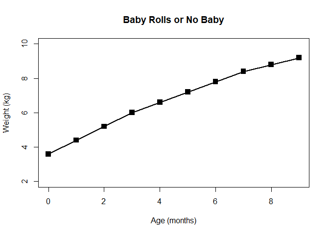<!-- -->

``` r
# Playing with plot options
plot(1:5, pch = 1:5, cex = 1:5)
```

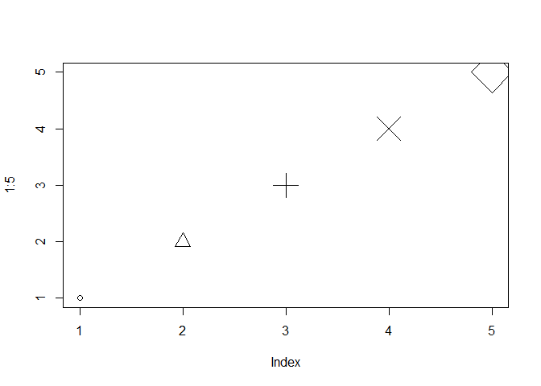<!-- -->

``` r
# Plot a barplot of the summary of different features in the mouse GRCm38 genome
mouse <- read.table("bimm143_05_rstats/feature_counts.txt", 
                    header = TRUE, sep = "\t")
  # OR...   read.delim("bimm143_05_rstats/feature_counts.txt")
  # Check plotting parameters
par()$mar
```

    ## [1] 5.1 4.1 4.1 2.1

``` r
  # Original parameters: [1] 5.1 4.1 4.1 2.1
  # These numbers represent the number of line on the edges of the plots FOR ALL PLOTS 
  # par(mar = c(from bottom, from left, from top, from right))
par(mar = c(3.5, 11, 3, 1))
barplot(mouse$Count,
        horiz = TRUE, ylab = "",
        names.arg = mouse$Feature, 
        main = "Drunk Mice at the Barplot", las = 1,
        xlim = c(0,80000))
```

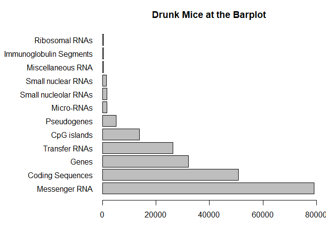<!-- -->

``` r
# Plot a histogram
par(mar = c(6.1, 4.1, 4.1, 2.1))
x <- c(rnorm(1000), rnorm(1000)+4)
hist(x, breaks=80)
```

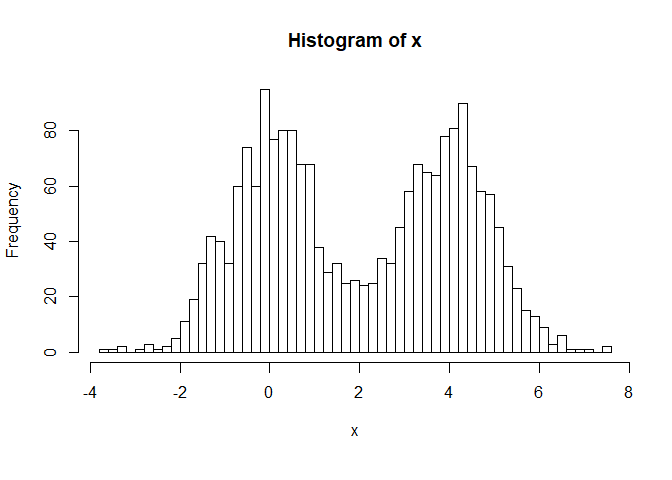<!-- -->

``` r
# Color vectors
mf <- read.delim("bimm143_05_rstats/male_female_counts.txt")
  # You can call colors by numbers, "names", rainbow(), 
  # heat.colors(), cm.colors(), terrain.colors(), topo.colors()
barplot(mf$Count, names.arg = mf$Sample, las = 2,
        col = rainbow(n = nrow(mf)), ylab = "Cunts")
```

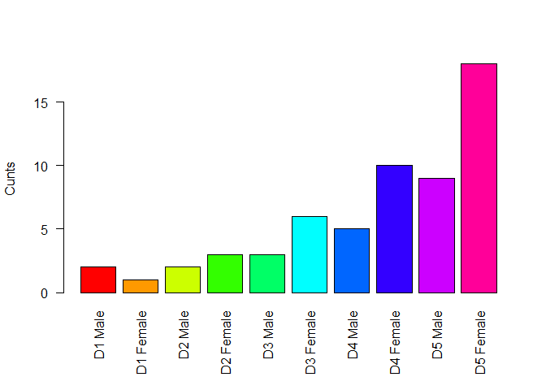<!-- -->

``` r
# Coloring by Value
genes <- read.delim("bimm143_05_rstats/up_down_expression.txt", header = TRUE)
  # How many genes are in each category (last column)
table(genes$State)
```

    ## 
    ##       down unchanging         up 
    ##         72       4997        127

``` r
palette(c("blue", "grey", "red"))
plot(genes$Condition1, genes$Condition2, col = genes$State,
     xlab = "Expression Condition 1", ylab = "Expression Condition 2")
```

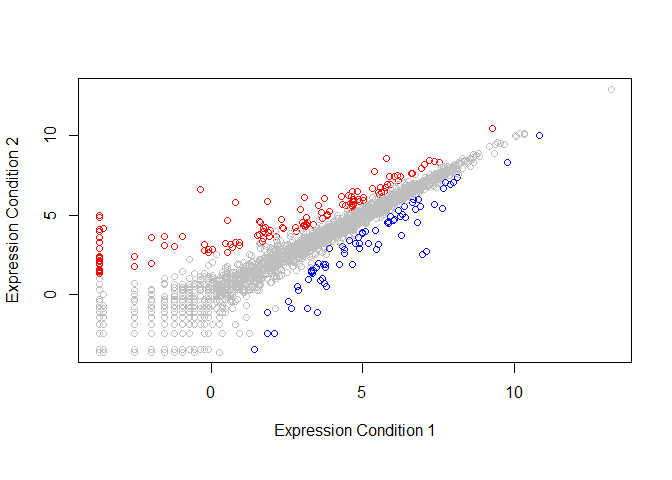<!-- -->

``` r
# Coloring by point density
meth <- read.delim("bimm143_05_rstats/expression_methylation.txt")
plot(meth$gene.meth, meth$expression)
```

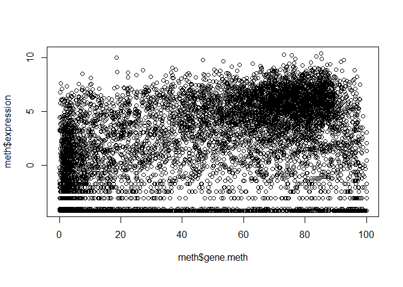<!-- -->

``` r
  # Coloring the busy plot using density
dcols <- densCols(meth$gene.meth, meth$expression)
plot(meth$gene.meth, meth$expression, col = dcols, pch = 20)
```

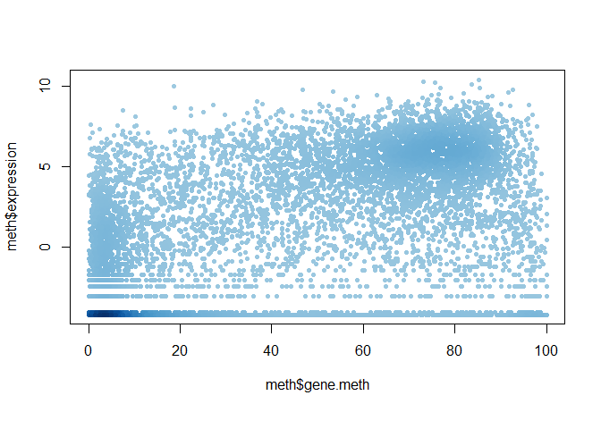<!-- -->

``` r
  # pch = 20 changes the plot to a solid circle

    # Find the indices of genes with above 0 expresion
    inds <- meth$expression > 0
    
    # Plot just these genes
    plot(meth$gene.meth[inds], meth$expression[inds])
```

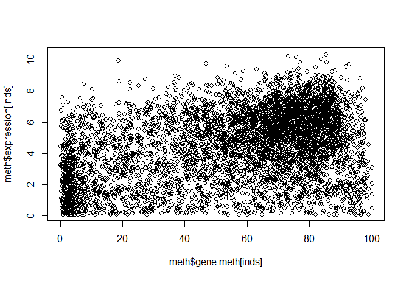<!-- -->

``` r
    ## Make a density color vector for these genes and plot
    dcols <- densCols(meth$gene.meth[inds], meth$expression[inds])
    
    plot(meth$gene.meth[inds], meth$expression[inds], col = dcols, pch = 20)    
```

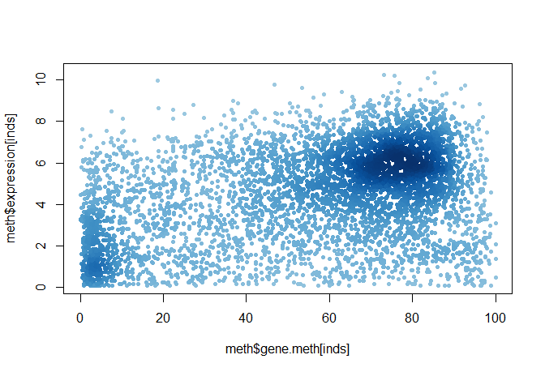<!-- -->

``` r
    ## Changing the color palette
    
    dcols.custom <- densCols(meth$gene.meth[inds], meth$expression[inds],
                             colramp = colorRampPalette(c("blue2",
                                                          "green2",
                                                          "red2",
                                                          "yellow")) )
    
    plot(meth$gene.meth[inds], meth$expression[inds], 
         col = dcols.custom, pch = 20)
```

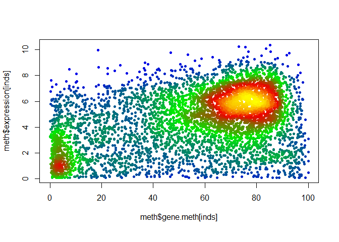<!-- -->
