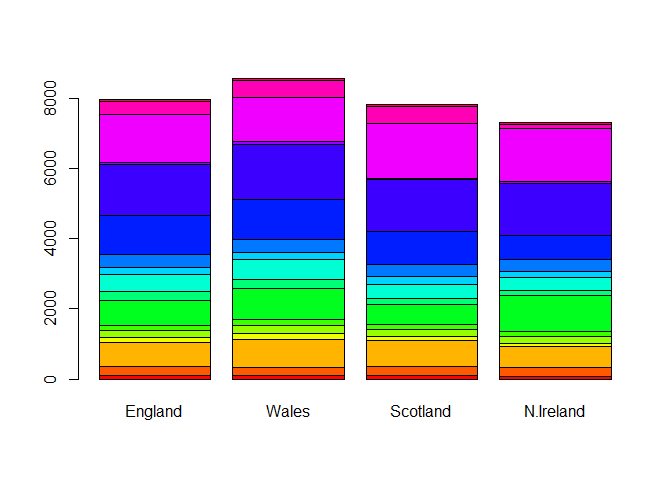

Class 08
================
Gabriela Goldberg
4/26/2019

## Kmeans clustering

Generate some example data for clustering

``` r
tmp <- c(rnorm(30,-3), rnorm(30,3))
x <- cbind(x=tmp, y=rev(tmp))

plot(x)
```

<!-- -->

Use the kmeans() function setting k to 2 and nstart=20 Inspect/print the
results

``` r
rand_kmeans <- kmeans(x, 2, nstart = 20)
point_allocation <- rand_kmeans$cluster
cluster_size <- rand_kmeans$size
cluster_centers <- rand_kmeans$centers
```

> Q. How many points are in each cluster? 30 points in each cluster

> Q. What ‘component’ of your result object details - cluster size? SIZE
> - cluster assignment/membership? CLUSTER - cluster center? CENTER

Plot x colored by the kmeans cluster assignment and add cluster centers
as blue points

``` r
plot(x, type = "p", col = point_allocation, pch = 16)
points(cluster_centers, type = "p", col = "blue", pch = 8, cex = 2)
```

<!-- -->

## Hierarchical clustering

Here we don’t have to spell out “K” the number of clusters before-hand,
but we do have to give it a distance matrix as input.

``` r
d <- dist(x)
hc <- hclust(d)
hc
```

    ## 
    ## Call:
    ## hclust(d = d)
    ## 
    ## Cluster method   : complete 
    ## Distance         : euclidean 
    ## Number of objects: 60

Let’s plot the results

``` r
plot(hc)
abline(h = 6, col = "red")
```

<!-- -->

``` r
cutree(hc, h = 6)
```

    ##  [1] 1 1 1 1 1 1 1 1 1 1 1 1 1 1 1 1 1 1 1 1 1 1 1 1 1 1 1 1 1 1 2 2 2 2 2
    ## [36] 2 2 2 2 2 2 2 2 2 2 2 2 2 2 2 2 2 2 2 2 2 2 2 2 2

Cut into two groups

``` r
gp2 <- cutree(hc, k = 2)
```

Cut into three groups

``` r
gp3 <- cutree(hc, k = 3)
```

Compare both clusterings

``` r
table(gp2, gp3)
```

    ##    gp3
    ## gp2  1  2  3
    ##   1 30  0  0
    ##   2  0 22  8

Our Turn\!\!\!

Step 1. Generate some example data for clustering

``` r
x <- rbind(
 matrix(rnorm(100, mean=0, sd = 0.3), ncol = 2), # c1
 matrix(rnorm(100, mean = 1, sd = 0.3), ncol = 2), # c2
 matrix(c(rnorm(50, mean = 1, sd = 0.3), # c3
 rnorm(50, mean = 0, sd = 0.3)), ncol = 2))
colnames(x) <- c("x", "y")
```

Step 2. Plot the data without clustering

``` r
plot(x)
```

<!-- -->

Step 3. Generate colors for known clusters (just so we can compare to
hclust results)

``` r
col <- as.factor( rep(c("c1","c2","c3"), each=50) )
plot(x, col=col, pch = 16)
```

<!-- -->

> Q. Use the dist(), hclust(), plot() and cutree() functions to return 2
> and 3 clusters

``` r
x_dist <- dist(x)
x_hc <- hclust(x_dist)
plot(x_hc)
```

<!-- -->

``` r
x_2grp <- cutree(x_hc, k = 2)
x_3grp <- cutree(x_hc, k = 3)
```

> Q. How does this compare to your known ‘col’ groups?

``` r
table(x_2grp)
```

    ## x_2grp
    ##   1   2 
    ## 107  43

``` r
table(x_3grp)
```

    ## x_3grp
    ##  1  2  3 
    ## 57 50 43

``` r
table(x_2grp, x_3grp)
```

    ##       x_3grp
    ## x_2grp  1  2  3
    ##      1 57 50  0
    ##      2  0  0 43

``` r
plot(x, col = x_3grp, pch = 16)
```

<!-- -->

``` r
plot(x, col = x_2grp, pch = 16)
```

<!-- -->

## Principal Component Analysis (PCA)

``` r
mydata <- read.csv("https://tinyurl.com/expression-CSV",
 row.names=1) 
head(mydata)
```

    ##        wt1 wt2  wt3  wt4 wt5 ko1 ko2 ko3 ko4 ko5
    ## gene1  439 458  408  429 420  90  88  86  90  93
    ## gene2  219 200  204  210 187 427 423 434 433 426
    ## gene3 1006 989 1030 1017 973 252 237 238 226 210
    ## gene4  783 792  829  856 760 849 856 835 885 894
    ## gene5  181 249  204  244 225 277 305 272 270 279
    ## gene6  460 502  491  491 493 612 594 577 618 638

There are 100 genes in this dataset.

Our genes are rows and our data are in columns. NOTE: prcomp() expects
the samples to be rows and genes to be columns so we need to first
transpose the matrix with the t() function\!

``` r
pca <- prcomp( t(mydata), scale. = TRUE)
summary(pca)
```

    ## Importance of components%s:
    ##                           PC1    PC2     PC3     PC4     PC5     PC6
    ## Standard deviation     9.6237 1.5198 1.05787 1.05203 0.88062 0.82545
    ## Proportion of Variance 0.9262 0.0231 0.01119 0.01107 0.00775 0.00681
    ## Cumulative Proportion  0.9262 0.9493 0.96045 0.97152 0.97928 0.98609
    ##                            PC7     PC8     PC9      PC10
    ## Standard deviation     0.80111 0.62065 0.60342 3.348e-15
    ## Proportion of Variance 0.00642 0.00385 0.00364 0.000e+00
    ## Cumulative Proportion  0.99251 0.99636 1.00000 1.000e+00

``` r
attributes(pca)
```

    ## $names
    ## [1] "sdev"     "rotation" "center"   "scale"    "x"       
    ## 
    ## $class
    ## [1] "prcomp"

Let’s make our first PCA plot\!

``` r
plot(pca$x[,1], pca$x[,2])
```

<!-- -->

Now we can determine the variation in the original data for each PC.

``` r
pca.var <- pca$sdev^2
pca.var.per <- round(pca.var/sum(pca.var)*100, 1)
pca.var.per
```

    ##  [1] 92.6  2.3  1.1  1.1  0.8  0.7  0.6  0.4  0.4  0.0

``` r
xlab <- paste("PC1 (", pca.var.per[1], "%)")
ylab <- paste("PC2 (", pca.var.per[2], "%)")
mycols <- c( rep("red", 5), rep("blue", 5))
plot(pca$x[,1], pca$x[,2], xlab = xlab, ylab = ylab, col = mycols, pch = 16)
```

<!-- -->

## My turn\!\!

``` r
x <- read.csv("UK_foods.csv")
```

> Q1. How many rows and columns are in your new data frame named x? What
> R functions could you use to answer this questions?

``` r
nrow(x)
```

    ## [1] 17

``` r
ncol(x)
```

    ## [1] 5

``` r
head(x)
```

    ##                X England Wales Scotland N.Ireland
    ## 1         Cheese     105   103      103        66
    ## 2  Carcass_meat      245   227      242       267
    ## 3    Other_meat      685   803      750       586
    ## 4           Fish     147   160      122        93
    ## 5 Fats_and_oils      193   235      184       209
    ## 6         Sugars     156   175      147       139

``` r
rownames(x) <- x[,1]
x <- x[,-1]
head(x)
```

    ##                England Wales Scotland N.Ireland
    ## Cheese             105   103      103        66
    ## Carcass_meat       245   227      242       267
    ## Other_meat         685   803      750       586
    ## Fish               147   160      122        93
    ## Fats_and_oils      193   235      184       209
    ## Sugars             156   175      147       139

``` r
dim(x)
```

    ## [1] 17  4

``` r
x <- read.csv("UK_foods.csv", row.names=1)
head(x)
```

    ##                England Wales Scotland N.Ireland
    ## Cheese             105   103      103        66
    ## Carcass_meat       245   227      242       267
    ## Other_meat         685   803      750       586
    ## Fish               147   160      122        93
    ## Fats_and_oils      193   235      184       209
    ## Sugars             156   175      147       139

> Q2. Which approach to solving the ‘row-names problem’ mentioned above
> do you prefer and why? Is one approach more robust than another under
> certain circumstances?

The second option is preferred because it takes less lines of code.

Let’s look at the data

``` r
barplot(as.matrix(x), beside=T, col=rainbow(nrow(x)))
```

<!-- -->

Q3: Changing what optional argument in the above barplot() function
results in the following plot?

``` r
barplot(as.matrix(x), beside=F, col=rainbow(nrow(x)))
```

<!-- -->

> Q5: Generating all pairwise plots may help somewhat. Can you make
> sense of the following code and resulting figure? What does it mean if
> a given point lies on the diagonal for a given plot?

``` r
pairs(x, col=rainbow(10), pch=16)
```

<!-- -->

> Q6. What is the main differences between N. Ireland and the other
> countries of the UK in terms of this data-set?

The blue dot is different in this dataset for N. Ireland.

Let’s do the PCA to see this difference\!

``` r
pca <- prcomp( t(x) )
summary(pca)
```

    ## Importance of components%s:
    ##                             PC1      PC2      PC3       PC4
    ## Standard deviation     324.1502 212.7478 73.87622 4.189e-14
    ## Proportion of Variance   0.6744   0.2905  0.03503 0.000e+00
    ## Cumulative Proportion    0.6744   0.9650  1.00000 1.000e+00

> Q7. Complete the code below to generate a plot of PC1 vs PC2. The
> second line adds text labels over the data points.

Plot PC1 vs
PC2

``` r
plot(pca$x[,1], pca$x[,2], xlab="PC1", ylab="PC2", xlim=c(-270,500), pch = 16)
text(pca$x[,1], pca$x[,2], colnames(x))
```

<!-- -->

> Q8. Customize your plot so that the colors of the country names match
> the colors in our UK and Ireland map and table at start of this
> document.

``` r
mycols <- c("orange", "red", "blue", "darkgreen")
plot(pca$x[,1], pca$x[,2], xlab="PC1", ylab="PC2", xlim=c(-270,500), pch = 16, col = mycols)
text(pca$x[,1], pca$x[,2], colnames(x), col = mycols)
```

<!-- -->

``` r
v <- round( pca$sdev^2/sum(pca$sdev^2) * 100 )
v
```

    ## [1] 67 29  4  0

``` r
z <- summary(pca)
z$importance
```

    ##                              PC1       PC2      PC3          PC4
    ## Standard deviation     324.15019 212.74780 73.87622 4.188568e-14
    ## Proportion of Variance   0.67444   0.29052  0.03503 0.000000e+00
    ## Cumulative Proportion    0.67444   0.96497  1.00000 1.000000e+00

``` r
barplot(v, xlab="Principal Component", ylab="Percent Variation")
```

<!-- -->

Lets focus on PC1 as it accounts for \> 90% of variance

``` r
par(mar=c(10, 3, 0.35, 0))
barplot( pca$rotation[,1], las=2 )
```

<!-- -->
